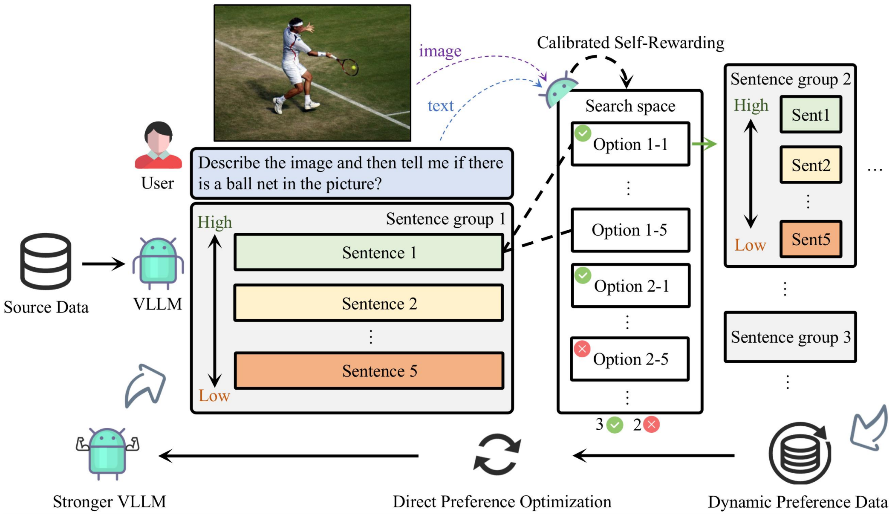
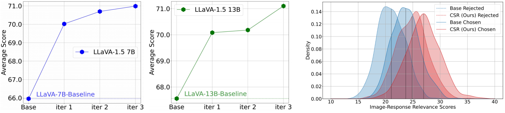

# Calibrated Self-Rewarding Vision Language Models
[Yiyang Zhou](https://yiyangzhou.github.io/)\*, [Zhiyuan Fan](https://zhiyuan.fan/)\*, [Dongjie Cheng](https://dongjie-cheng.github.io/)\*, Sihan Yang, [Zhaorun Chen](https://billchan226.github.io/), [Chenhang Cui](https://gzcch.github.io/), [Xiyao Wang](https://si0wang.github.io/), [Yun Li](https://yunliweb.its.unc.edu/people.html#YunLi), [Linjun Zhang](https://linjunz.github.io/), [Huaxiu Yao](https://sites.google.com/view/danicaxiao/home)

<div align="center">
</div>
<div align="center">
    <a href="https://huggingface.co/charlesdj"></a>
    <a href="https://arxiv.org/pdf/2405.14622"></a>
    <a href="https://x.com/HuaxiuYaoML/status/1794203052116680895"></a>
</div>


[[Project page](https://csr.github.io/)]

**Citation**: If you find this repo useful for your research, please consider citing the paper
```
@article{zhou2024calibrated,
  title={Calibrated Self-Rewarding Vision Language Models},
  author={Zhou, Yiyang and Fan, Zhiyuan and Cheng, Dongjie and Yang, Sihan and Chen, Zhaorun and Cui, Chenhang and Wang, Xiyao and Li, Yun and Zhang, Linjun and Yao, Huaxiu},
  journal={arXiv preprint arXiv:2405.14622},
  year={2024}
}
```

## Table of Contents
- [About CSR](#About-CSR)
- [Installation](#Installation)
- [Instruction](#Instruction)
- [Acknowledgement](#Acknowledgement)

## About CSR
<p align="center">
     <br>
   Framework of Calibrated Self-Rewarding (CSR)
</p>

Existing methods use additional models or human annotations to curate preference data and enhance modality alignment through preference optimization. These methods are resource-intensive and may not effectively reflect the target LVLM’s preferences, making the curated preference data easily distinguishable. To address these challenges, we proposes the  **C**alibrated  **S**elf- **R**ewarding (**CSR**), which enables the model to self-improve by iteratively generating candidate responses, evaluating the reward for each response, and curating preference data for fine-tuning. In reward modeling, a step-wise strategy is adopted, and visual constraints are incorporated into the self-rewarding process to emphasize visual input.

<p align="center">
     <br>
   Left: Different parameter sizes of LLaVA 1.5 can enhance their learning through CSR iterations. Right: The change in image relevance scores before and after employing CSR.
</p>

Through the online CSR process, the model continuously enhances its performance across various benchmarks and improves the overall relevance scores of its responses to visual inputs. Additionally, it reduces the gap between rejected responses and chosen responses, thereby improving the model's performance lower bound.

## Installation
The build process based on [LLaVA 1.5](https://github.com/haotian-liu/LLaVA):

1. Clone this repository and navigate to LLaVA folder

```Shell
git clone https://github.com/haotian-liu/LLaVA.git
cd LLaVA
git clone https://github.com/YiyangZhou/CSR.git
```

2. Install Package

```Shell
conda create -n csr python=3.10 -y
conda activate csr
pip install --upgrade pip
pip install -e .
```

3. Install additional packages for training cases

```Shell
pip install -e ".[train]"
pip install flash-attn --no-build-isolation
```

4. Install trl package

```Shell
pip install trl
```

5. Modify the TRL library adjust DPO for LVLMs

```Shell
cd *your conda path*/envs/csr/lib/python3.10/site-packages/trl/trainer/
# Replace dop_trainer.py with dop_trainer.py in the 'train_csr' folder.
```

6. Modify the parent class of llava_trainer

```Shell
cd ./LLaVA/llava/train

# Modify llava_trainer.py as follows:

# from trl import DPOTrainer
# ...
# ...
# ...
# class LLaVATrainer(DPOTrainer):
```

## Instruction
Before starting, you need to:

(1) modify the path in **'./CSR/scripts/run_train.sh'** to your own path.

(2) If you are using wandb, you need to enter your key in **'./CSR/train_csr/train_dpo_lora.py'** by filling in **'wandb.login(key="your key")'** with your key.

(3) Download the image data from the [COCO website](https://cocodataset.org/#download) into **'./data/images/'**(or you can prepare your own images and prompt data).

### Step 1. Construct Preference Data. 
First, prepare the COCO-2014 train images in the **'./data/images/'**. Then complete the following steps in sequence.
```Shell
cd ./CSR/inference_csr
bash ./step1.sh
```
```Shell
bash ./step2.sh
```
```Shell
bash ./step3.sh
```
You now have the preference dataset.
This process takes a long time. We provide our preference datasets in huggingface.

### Step 2. Direct Preference Optimization (DPO). 

```Shell
bash ./CSR/scripts/run_train.sh
```

### Step 3. Iterative Learning. 
After completing a round of CSR training, you need to merge the current LoRA checkpoint. Use the merged checkpoint as the base model and proceed with **Step 1** and **Step 2** sequentially.

```Shell
python ./scripts/merge_lora_weights.py --model-path "your LoRA checkpoint path" --model-base "your llava 1.5 checkpoint path --> your Iter-1 path --> your Iter-2 path ...." --save-model-path "xxx"
```

## Data and Models
| Dataset                    |                           Download                           |               | Model(7B)                     |                           Download                           |               | Model(13B)                     |                           Download                           |
| :----------------------- | :----------------------------------------------------------: | :-----------: | :------------------------ | :----------------------------------------------------------: | :-----------: | :------------------------ | :----------------------------------------------------------: |
| CSR_iter0     | 🤗 [HuggingFace](https://huggingface.co/datasets/charlesdj/CSR-12K-iter0) |               | CSR-7B-iter1  | 🤗 [HuggingFace](https://huggingface.co/charlesdj/CSR_LLaVA_1.5_7b_1Iteration) |               | CSR-13B-iter1  | 🤗 [HuggingFace](https://huggingface.co/charlesdj/CSR_LLaVA_1.5_13b_1Iteration) |
| CSR_iter1 | 🤗 [HuggingFace](https://huggingface.co/datasets/charlesdj/CSR-12K-iter1) |               | CSR-7B-iter2 | 🤗 [HuggingFace](https://huggingface.co/charlesdj/CSR_LLaVA_1.5_7b_2Iteration) |               | CSR-13B-iter2 | 🤗 [HuggingFace](https://huggingface.co/charlesdj/CSR_LLaVA_1.5_13b_2Iteration) |
| CSR_iter2      |   🤗 [HuggingFace](https://huggingface.co/datasets/charlesdj/CSR-12K-iter2) |               | CSR-7B-iter3  | 🤗 [HuggingFace](https://huggingface.co/charlesdj/CSR_LLaVA_1.5_7b_3Iteration) |               | CSR-13B-iter3  | 🤗 [HuggingFace](https://huggingface.co/charlesdj/CSR_LLaVA_1.5_13b_3Iteration) |


## Evaluation
Here are two convenient ways to perform evaluations:

1. Use the eval scripts provided in [LLaVA](https://github.com/haotian-liu/LLaVA/blob/main/docs/Evaluation.md).
   
3. Utilize [lmms-eval](https://github.com/EvolvingLMMs-Lab/lmms-eval), a general evaluation platform.

5. CHAIR metrics in [LURE](https://github.com/YiyangZhou/LURE).

## Acknowledgement
- This repository is built upon [LLaVA](https://github.com/haotian-liu/LLaVA)!
- We thank the [Center for AI Safety](https://www.safe.ai/) for supporting our computing needs. This research was supported by Cisco Faculty Research Award.
